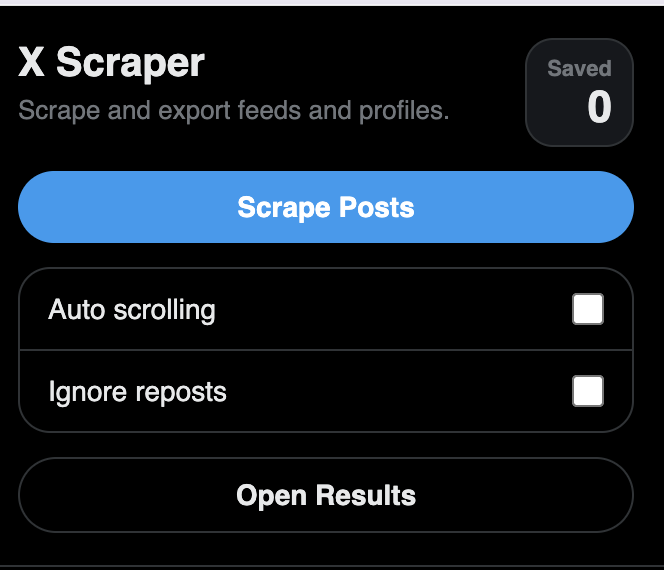

# X Scraper Chrome Extension

X Scraper is a Chrome extension for collecting post data directly from X profile pages. It provides a lightweight workflow for crawling visible posts, storing their metadata, and reviewing the results in a separate tab.

Created by [robaiapps](https://x.com/robaiapps)

## Overview

This project is designed for users who want a simple way to capture publicly visible post data from X profile pages while browsing in Chrome. After loading a profile and scrolling through the content you want to include, the extension can crawl the page and save the available post metadata for later review.

## Features

- Scrape post data from X profile pages
- Capture metadata from posts currently loaded in the browser
- Track how many posts have been saved
- Open a dedicated results view for reviewing collected data
- Run locally as an unpacked Chrome extension

## Installation

1. Open Google Chrome.
2. Go to `chrome://extensions`.
3. Enable `Developer mode` in the top-right corner.
4. Click `Load unpacked`.
5. Select this project folder.
6. Confirm that the `X Scraper` extension appears in your extensions list and toolbar.

## How to Use

1. Open an X profile page, such as `https://x.com/someuser`.
2. Scroll through the profile to load the posts you want to capture.
3. Click the X Scraper icon in the Chrome toolbar.
4. In the popup, click `Crawl Page`.
5. Wait for the extension to process the visible posts and update the saved-post counter.
6. Click `See Results` to open the collected output in a new tab.

## Notes

- The extension scrapes posts that are currently loaded on the page, so scrolling is required before crawling additional content.

## Our Other Projects

- [Skincare AI analysis](https://howolddoyoulook.com/skincare)
- [looksmax report](https://attractivenesstest.com/looksmax)
